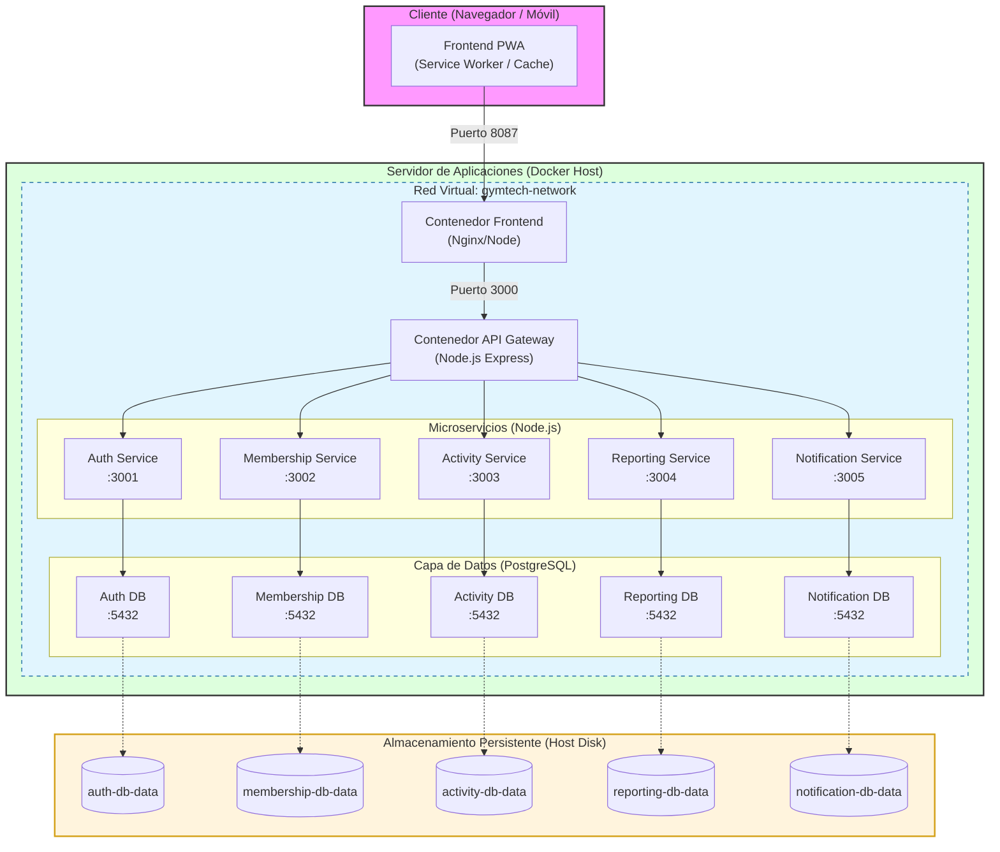

# Diagrama de Despliegue - GymTech

Este documento describe la infraestructura física y lógica donde se despliega la plataforma GymTech.

## Diagrama de Despliegue

## Detalles Técnicos del Despliegue

### 1. Infraestructura de Contenedores
El proyecto utiliza **Docker** y **Docker Compose** para encapsular cada componente. Esto garantiza que el entorno de ejecución sea idéntico entre desarrollo y producción.

### 2. Red y Comunicación
Todos los contenedores están unidos por la red `gymtech-network`. 
- El **API Gateway** actúa como el único punto de entrada externo para las peticiones de backend.
- La comunicación interna se realiza mediante el DNS interno de Docker (ej. `http://auth-service:3001`).

### 3. Estrategia de Persistencia
Para evitar la pérdida de datos al reiniciar o actualizar los contenedores, se utilizan **Volúmenes Nombrados de Docker**. Cada base de datos tiene su propio volumen mapeado al disco físico del servidor host.

### 4. Puertos Expuestos
| Componente | Puerto Externo | Puerto Interno | Protocolo |
|------------|----------------|----------------|-----------|
| Frontend   | 8087           | 80             | HTTP/HTTPS|
| Gateway    | 3000           | 3000           | HTTP      |
| Microservicios | N/A        | 3001-3005      | HTTP      |
| Bases de Datos | N/A        | 5432           | TCP/SQL   |
